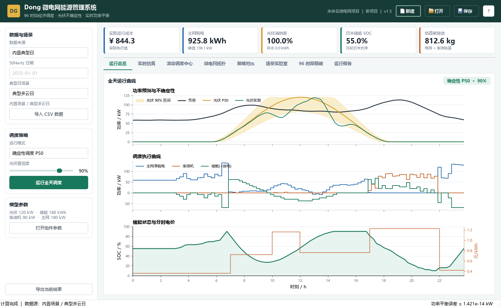
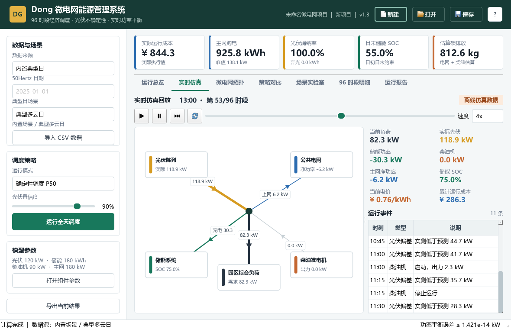
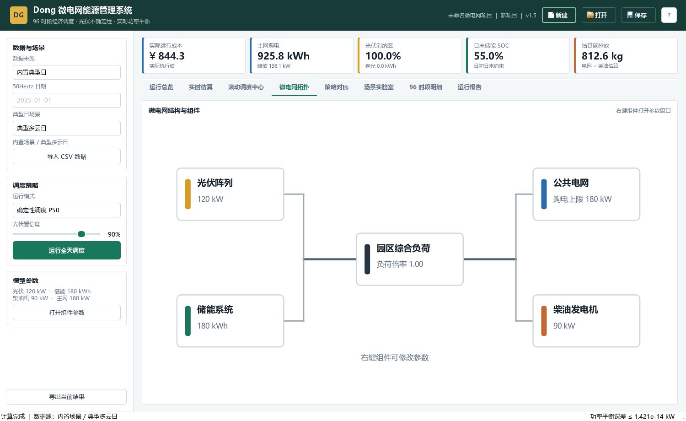
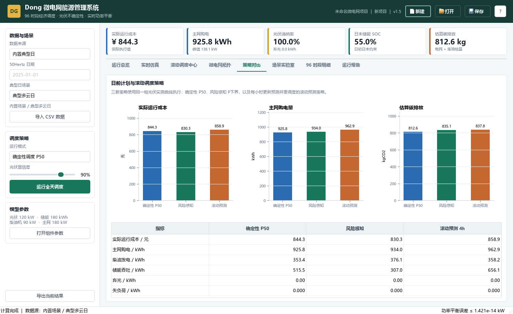
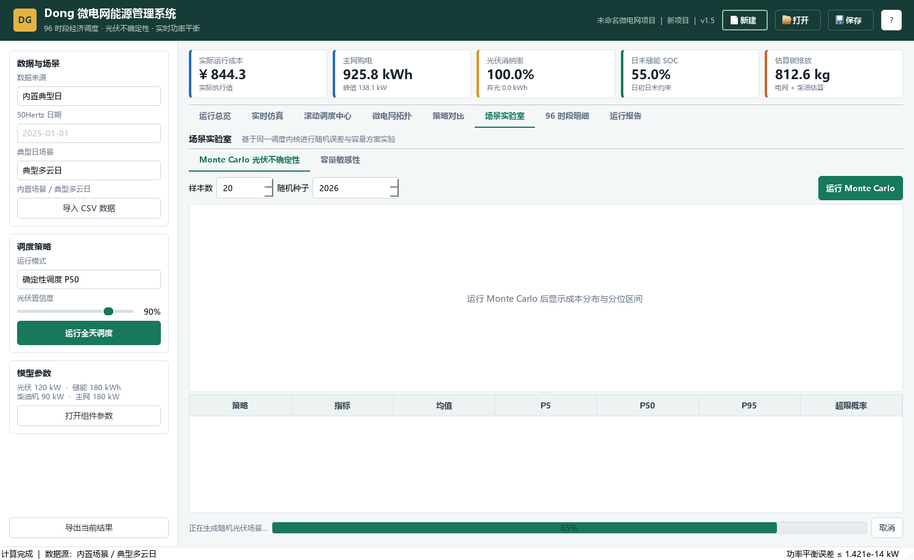
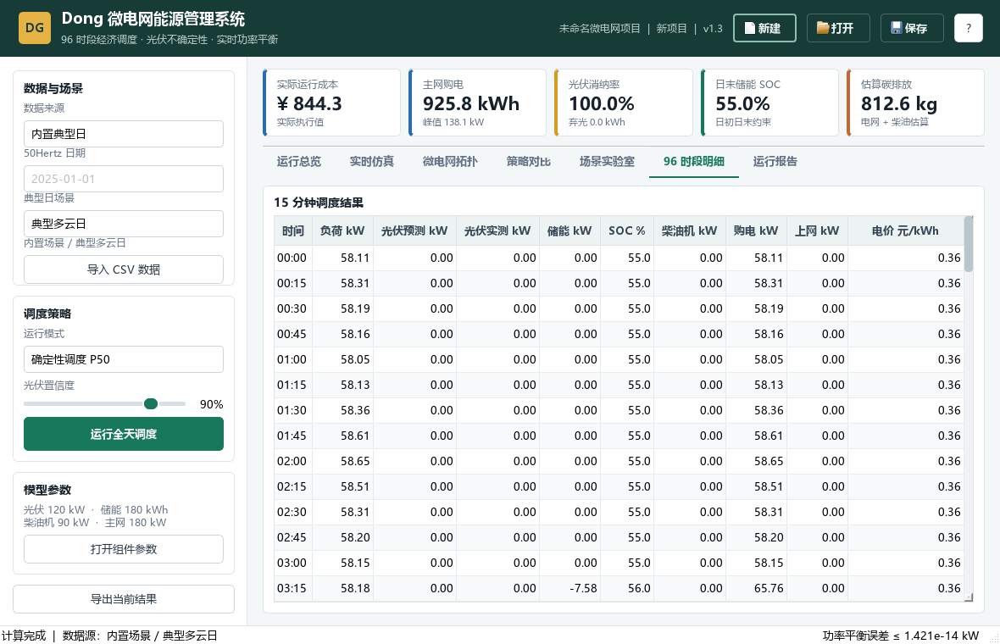
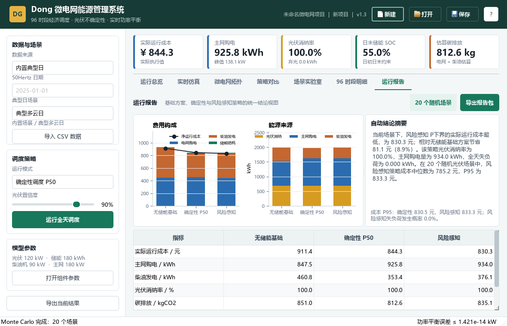

# Dong 微电网能源管理系统 v1.4 使用说明书

版本：1.4.0  
目标平台：Windows 10/11 x64  
课程用途：程序设计大作业演示与录屏

## 1. 软件简介

Dong v1.4 用于模拟一个包含光伏、储能、柴油发电机、园区负荷和公共电网的微电网。软件可以读取 96 个 15 分钟时段的数据，生成确定性、风险感知和滚动预测调度计划，在模拟实际光伏上执行实时功率平衡，并通过回放、滚动调度中心、统计实验和运行报告解释结果。v1.4 还支持 50Hertz 德国区域光伏年度数据。

“实时仿真”是离线结果回放，不是硬件监控。答辩时应明确这一点。

## 2. 系统要求

### 2.1 便携 EXE

- Windows 10/11 64 位。
- 建议至少 4 GB 内存，显示分辨率不低于 `1180×760`。
- 不需要安装 Python。
- EXE 所在文件夹中的 `_internal` 不能删除或与 EXE 分离。

### 2.2 源码运行

- Windows x64 Python 3.11 或更高版本。
- PySide6、Matplotlib、NumPy、Pandas；构建 EXE 时还需要 PyInstaller。
- 首次安装依赖需要可访问 Python 包索引的网络。

## 3. 启动软件

### 3.1 使用便携 EXE

进入发布包中的：

```text
dist\DongMicrogridEMS\
```

双击 `DongMicrogridEMS.exe`。首次启动可能比后续启动慢几秒，这是 Qt 与 Matplotlib 运行库初始化造成的。

### 3.2 使用源码

首次使用双击 `setup.bat`，等待出现安装完成提示；以后双击 `run.bat` 即可。

也可以在 PowerShell 中运行：

```powershell
cd Dong_v1.4
$env:PYTHONNOUSERSITE='1'
.\.venv\Scripts\python.exe main.py
```

### 3.3 打开示例项目

点击顶部“打开”，选择：

```text
sample_data\Dong_v1.3_示例项目.dong
```

项目打开后会重新计算，不读取旧缓存。窗口标题不带 `*` 表示当前状态已保存。

## 4. 顶部与侧栏操作

顶部“新建、打开、保存”管理 `.dong` 项目。修改场景、置信度、显示策略或组件参数后，项目名旁会出现 `*`；关闭、新建或打开其他项目前，软件会询问是否保存。

左侧分为三部分：

- 数据与场景：切换三种内置典型日或导入 CSV。
- 调度策略：切换确定性、风险感知和滚动预测结果，调整置信度，重新运行。
- 模型参数：查看容量摘要，打开组件参数窗口。

底部“导出当前结果”输出当前策略的 96 时段 CSV 和指标 JSON。它与“运行报告”页的完整报告包不同。

## 5. 八个页面

### 5.1 运行总览



上图展示光伏置信区间、负荷、P50 与模拟实测光伏；中图展示主网、柴油机和储能调度；下图展示 SOC 与分时电价。储能功率为正表示放电，为负表示充电。顶部五个指标会随当前显示策略变化。

建议演示时先指出黄色置信区间，再观察多云时段实测光伏下降后储能与主网如何补偿。

### 5.2 实时仿真



页面明确标有“离线仿真数据”。控制栏支持：

- 播放、暂停、前进一个时段、复位。
- 拖动时间轴直接跳到任意时刻。
- `1x / 4x / 8x / 16x` 回放速度。

功率流线的颜色对应能源类型，线宽随功率增大；箭头表示方向。右侧显示负荷、光伏、储能、柴油机、主网、SOC、电价和累计成本。事件表记录显著光伏偏差、柴油机启停、SOC 低位、主网高负荷、弃光和失负荷。

### 5.3 微电网拓扑



该页展示五类组件和公共母线。右键任一组件，选择“修改组件参数”，应用后软件会重新生成内置场景并调度。使用自定义 CSV 时，修改额定光伏容量不会自动缩放 CSV 中的光伏曲线，需保证数据与参数含义一致。

### 5.4 策略对比



柱形图比较确定性、风险感知和滚动预测策略的实际成本、主网购电量和碳排放；表格给出成本、购电、柴油、储能吞吐、弃光和失负荷。三套策略在同一条模拟实际光伏曲线上执行，因此比较是公平的。

### 5.5 滚动调度中心

该页是 v1.4 的新增功能。它以离线仿真方式模拟实时判断：每 4 个 15 分钟点（1 小时）更新一次 EWMA 光伏偏差，修正未来 16 个点（4 小时）的预测，再用动态规划重新安排储能路径，实际只执行当前小时的动作。图中的竖线表示重优化时刻，主网负载率达到 82% 时标记为“电网紧张”，高价时段进一步标记为“高价削峰”，供电不足时标记为“保供告警”。

EWMA 的含义是对最近预测误差加权平均：

`bias(t) = 0.35 × error(t-1) + 0.65 × bias(t-1)`

这不是接入真实电网，而是按时间顺序回放已知数据，不能在答辩中表述为在线遥测控制。

### 5.6 场景实验室



Monte Carlo 子页默认使用 200 个相关光伏误差场景和随机种子 2026。点击运行后可查看进度并取消；箱线图表示成本分布，区间图表示 P5–P50–P95，表格给出全部指标。

容量敏感性子页可选择：

- 储能容量，默认 `60–300 kWh`。
- 光伏容量，默认 `60–240 kW`。
- 方案点数，默认 7 个等距点。

每个点都会重新优化。趋势图同步展示成本、主网购电、碳排放和光伏消纳率；数值表还包含弃光。

### 5.7 96 时段明细



表格逐行列出时间、负荷、日前预测、滚动预测、实测光伏、储能、SOC、柴油机、购电、上网、电价、EWMA 偏差、主网负载率、电网状态和重优化标记。它适合在答辩时证明程序确实计算了 96 个时段，也可用于核对某一回放时刻。

### 5.8 运行报告



报告页统一比较无储能基础、确定性 P50 和风险感知三种方案。费用构成、能源来源、碳排放、最低 SOC 和自动结论会随当前项目重算。完成 Monte Carlo 后，右上角和摘要底部会同步显示随机场景数、成本 P95 与失负荷概率。

点击“导出报告包”，选择父目录后，软件会新建带时间戳的报告目录。

## 6. 推荐完整演示流程

1. 打开 `Dong_v1.3_示例项目.dong`，说明项目文件保存输入而不保存结果缓存。
2. 在运行总览指出 96 时段、光伏区间、实测曲线、储能功率和 SOC。
3. 切到实时仿真，拖到 13:00 左右，播放并解释箭头方向、累计成本和事件日志。
4. 在策略对比说明风险感知策略使用更保守的光伏下界。
5. 在微电网拓扑右键储能，把容量临时改为 220 kWh，观察自动重算，再改回 180 kWh。
6. 在场景实验室将 Monte Carlo 样本数设为 50，点击运行，展示进度、箱线图和分位数表。
7. 切换容量敏感性，使用默认 7 点运行，解释“增加容量后的边际收益”。
8. 在 96 时段明细选择一个高价时段，核对购电、柴油和 SOC。
9. 打开运行报告，说明基础方案与两种调度方案的成本和碳排差异。
10. 导出报告包，打开 `RUN_REPORT.md`、一份 CSV 和 `charts` 文件夹结束演示。

## 7. 建议录屏脚本（约 5–7 分钟）

| 时间 | 画面 | 建议讲解 |
| --- | --- | --- |
| 0:00–0:35 | 打开示例项目 | 项目目标、五类组件、96 个时段、离线仿真边界 |
| 0:35–1:25 | 运行总览 | P50、置信区间、实测误差、功率平衡和 SOC |
| 1:25–2:15 | 实时仿真 | 播放/暂停、功率流方向、事件、累计成本 |
| 2:15–2:55 | 拓扑与参数 | 右键储能修改参数并自动重算 |
| 2:55–3:35 | 策略对比 | 确定性与风险感知的成本/风险权衡 |
| 3:35–4:45 | 场景实验室 | 运行 50 样本 Monte Carlo，再展示容量趋势 |
| 4:45–5:20 | 96 时段明细 | 核对具体时刻，说明功率符号 |
| 5:20–6:10 | 运行报告 | 基线节省、碳排、P95、自动结论 |
| 6:10–结束 | 导出报告包 | 展示 Markdown、CSV、JSON、PNG，可复现实验 |

录屏前建议使用 `1500×920` 窗口、关闭系统通知、预先建立空的报告输出目录。为避免等待过长，录屏可用 50 个 Monte Carlo 样本；最终结果展示时再运行默认 200 个样本。

## 8. CSV 数据格式

CSV 必须有 96 行，推荐 UTF-8 with BOM。支持字段：

| 列名 | 必填 | 含义 |
| --- | --- | --- |
| `time` | 是 | 时间标签，例如 `00:00` |
| `load_kw` | 是 | 负荷功率，kW |
| `pv_forecast_kw` | 是 | 日前光伏预测，kW |
| `pv_actual_kw` | 否 | 模拟实测光伏；缺少时等于预测 |
| `price_yuan_kwh` | 是 | 主网购电价，元/kWh |

数值不能为负、为空或非数字。软件也兼容说明书对应含义的部分中文列名。示例为 `sample_data\typical_cloudy_day.csv`。

## 9. 50Hertz 真实数据

在左侧“数据来源”选择“50Hertz 德国光伏 2025”，再从日期下拉框选择 2025 年的任意一天。文件位于 `sample_data\Solarenergie_Hochrechnung_2025.csv`，包含 365 天的区域光伏功率估算。普通日期有 96 个 15 分钟点；德国夏令时切换日可能有 92 或 97 个点，软件会使用线性插值统一到 96 点。

原始 `MW` 曲线按全年最大值归一化，再缩放到当前模型的光伏额定容量。负荷和电价仍使用微电网的课程演示参数。日前预测使用所选日期前最多 14 天的同一时刻中位数；年初没有历史窗口时，使用实际曲线的 92% 作为保守基线。因此这个预测是可解释的统计基线，不是 50Hertz 官方预测，也不能据此计算真实预测准确率。

“导入 CSV 数据”按钮也会自动识别该格式，并默认载入文件中的第一天；需要切换日期时回到“数据来源”下拉框选择 50Hertz，再选择目标日期。

## 10. `.dong` 项目格式

项目文件是 UTF-8 JSON，关键字段如下：

```json
{
  "schema_version": 1,
  "project_name": "项目名称",
  "strategy_key": "risk_aware",
  "confidence_pct": 90.0,
  "config": {
    "pv": {},
    "battery": {},
    "diesel": {},
    "grid": {},
    "load": {}
  },
  "scenario": {
    "time_labels": [],
    "load_kw": [],
    "pv_forecast_kw": [],
    "pv_actual_kw": [],
    "buy_price_yuan_kwh": [],
    "source_name": ""
  }
}
```

请通过软件保存项目，不建议手工修改。未知 `schema_version`、缺少字段、损坏 JSON 或非法参数会被拒绝，并显示明确错误原因。

## 11. 报告输出

完整报告包包含：

- `RUN_REPORT.md`：可直接阅读或转换为 PDF 的主报告。
- `summary.json`：项目配置、三方案指标、费用构成和结论。
- `dispatch_baseline.csv`：无储能基础方案。
- `dispatch_deterministic.csv`：确定性方案 96 点结果。
- `dispatch_risk_aware.csv`：风险感知方案 96 点结果。
- `monte_carlo_samples.csv` 与 `monte_carlo_summary.csv`：已运行随机实验时生成。
- `sensitivity.csv`：已运行容量实验时生成。
- `charts\*.png`：报告引用的对比、调度和实验图表。

## 12. 指标与符号解释

- `P50`：光伏预测中位曲线。
- `P下界`：给定置信度下的保守光伏曲线。
- `SOC`：储能剩余电量占额定容量百分比。
- 储能功率 `> 0`：放电；`< 0`：充电。
- 主网净功率 `> 0`：购电；`< 0`：上网。
- `P5/P50/P95`：随机结果的 5%、50%、95% 分位数。
- 超限概率：样本超过该指标预设风险阈值的比例。
- 光伏消纳率：实际光伏能量扣除弃光后的利用比例。
- 失负荷：组件与主网容量仍不足时未满足的电量；正常示例应为 0。
- 碳排放：主网购电和柴油发电按配置排放因子估算，不是计量认证值。

## 13. 快捷键

| 快捷键 | 功能 |
| --- | --- |
| `Ctrl+N` | 新建项目 |
| `Ctrl+O` | 打开 `.dong` 项目 |
| `Ctrl+S` | 保存项目 |
| `Ctrl+Shift+S` | 项目另存为 |
| `Ctrl+I` | 导入 CSV |
| `Ctrl+E` | 导出当前策略 CSV + JSON |
| `Ctrl+R` | 重新运行全天调度 |
| `F1` | 模型与策略说明 |

回放控制目前使用页面按钮和速度下拉框，避免与项目快捷键冲突。

## 14. 常见问题与排查

### EXE 双击没有反应

确认没有只复制单个 EXE；`DongMicrogridEMS.exe` 必须与 `_internal` 保持原目录关系。优先从本地磁盘的普通文件夹运行，不要直接在 ZIP 预览窗口中运行。

### Windows 提示来源未知

课程自建 EXE 未进行商业代码签名，Windows 可能显示 SmartScreen 提示。确认文件来自本组发布包并核对 SHA-256 后，再选择“更多信息 → 仍要运行”。

### 中文显示为方框或图表缺字

软件优先使用 Microsoft YaHei UI、Microsoft YaHei、SimHei、DengXian。标准 Windows 10/11 通常已包含微软雅黑；精简系统需恢复中文字体。源码运行时应设置 `PYTHONNOUSERSITE=1`，避免损坏的用户级 Matplotlib 覆盖虚拟环境。

### 路径包含中文时启动失败

v1.4 已按中文路径测试。仍出现问题时，先把整个发布目录解压到 `C:\Dong_v1.4` 验证；不要使用过长路径，也不要从只读压缩包内部运行。

### `setup.bat` 安装失败

检查 Python 版本和网络，确认安装 Python 时勾选 `Add Python to PATH`。删除不完整的 `.venv` 后重新运行会重新创建环境；删除前请确认目标确实是本项目内的 `.venv`。

### 打开 `.dong` 失败

错误提示会区分损坏 JSON、缺字段和未知版本。不要把 CSV 改名为 `.dong`。可重新打开随软件提供的示例项目确认程序本身正常。

### Monte Carlo 很慢

运行时间随样本数近似线性增长。录屏使用 50 个样本，最终统计使用默认 200 个。计算中可按“取消”，程序会在当前样本结束后停止。

### 修改参数后旧实验结果消失

这是预期行为。参数、场景或置信度变化后，旧随机实验和容量实验已经失效，软件会清除或丢弃旧结果，防止报告混用不同输入。

### 导出的 Markdown 图片不显示

不要只移动 `RUN_REPORT.md`；它使用相对路径引用同一报告包下的 `charts` 文件夹。应整体复制报告目录。

## 15. 课程答辩边界

已经实现：典型日、50Hertz 区域光伏数据、确定性/风险感知调度、实时误差补偿、Monte Carlo、容量敏感性、项目文件、桌面 UI 和报告导出。

没有实现：真实硬件通信、多日预测、数据库、柴油机整数启停和最小开停机时间、MPC、商业级电价结算。建议把这些作为后续工作，不要在演示中误称为现有功能。
