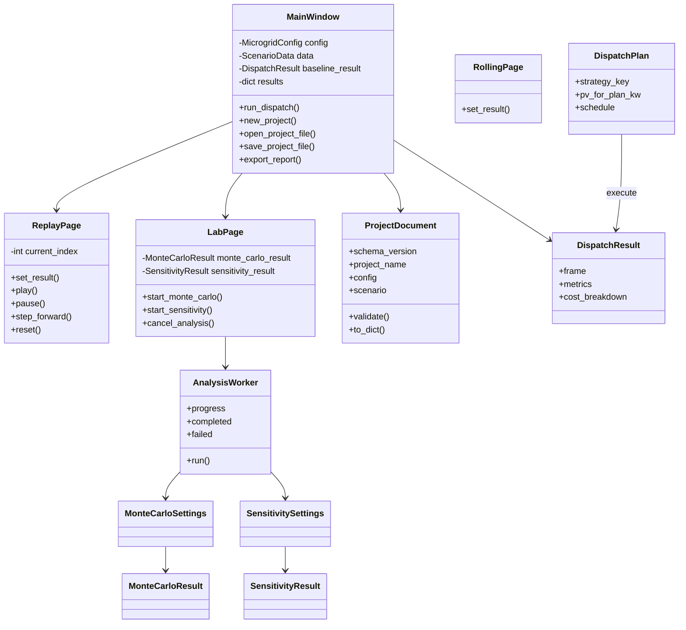
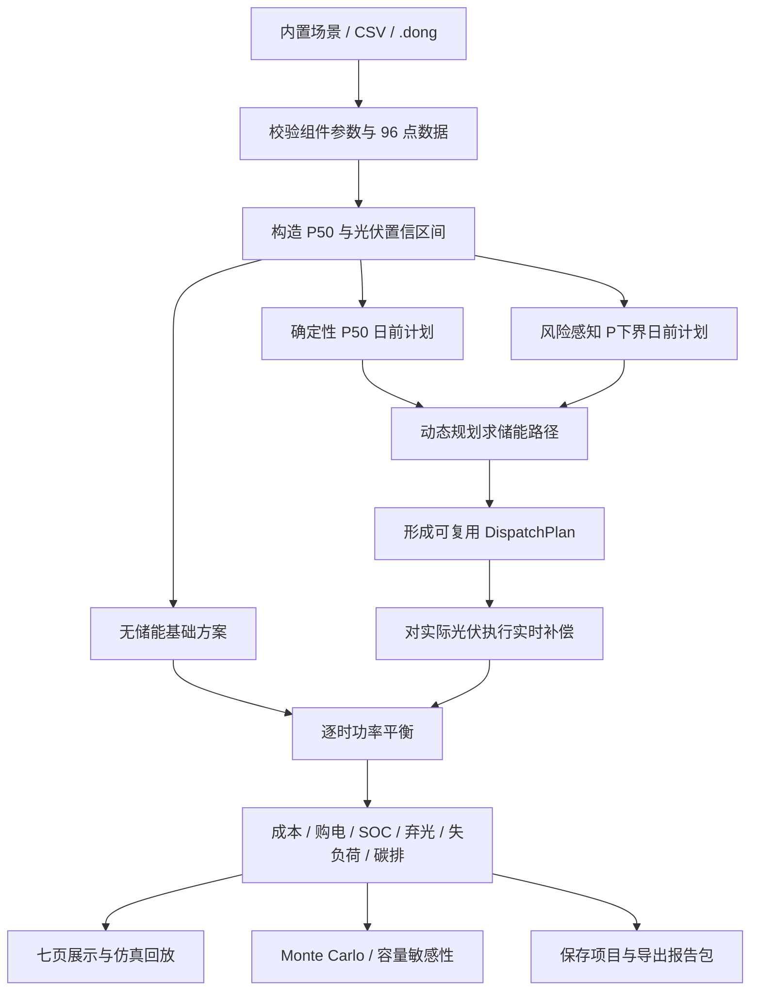

# Dong v1.4 软件设计说明

## 1. 设计目标

系统围绕“输入场景 → 构造日前计划 → EWMA 滚动预测修正 → 每小时滚动重调度 → 实时功率平衡 → 统计与实验 → 保存/导出”形成可演示、可测试的完整闭环。界面仅负责交互与展示，调度、实验、项目和报告均为独立 Python 模块，可在不启动 Qt 的情况下测试。

## 2. 需求映射

| 课程与演示需求 | v1.4 实现 |
| --- | --- |
| 微电网组件面向对象建模 | 光伏、储能、柴油机、主网和负荷均为数据类 |
| 图形化拓扑与参数修改 | 拓扑页右键组件打开参数对话框 |
| 96 点数据输入和输出 | 内置场景、CSV 导入、逐时表和 CSV 导出 |
| 确定性调度 | 以储能电量为状态的 96 时段动态规划 |
| 光伏不确定性策略 | 置信区间、P 下界计划、实时储能误差补偿 |
| 风险量化 | 相关误差 Monte Carlo、P5/P50/P95、均值和超限概率 |
| 容量研究 | 储能/光伏容量等距方案点与四项趋势 |
| 滚动调度策略 | 4 小时预测窗口、每小时重规划、主网负载状态判断 |
| 易操作桌面界面 | 八页工作台、回放控制、滚动调度中心、后台进度与取消 |
| 可分享工程状态 | 有版本校验的 JSON `.dong` 项目文件 |
| 可提交结果 | Markdown、CSV、JSON、PNG 组成的报告包 |
| 流畅交互 | 不透明内容面板错峰淡入、结果刷新反馈、KPI 与状态栏脉冲，动画结束自动清理 |

## 3. 分层结构

```text
PySide6 页面与交互
        │
        ├─ MainWindow：项目状态、页面协调、调度触发
        ├─ ReplayPage：96 时段回放与事件记录
        ├─ RollingPage：EWMA 预测修正、主网负载率与重优化记录
        ├─ LabPage + Worker：后台实验、进度和取消
        └─ ReportPage：统一比较与报告导出入口
        │
应用服务层
        ├─ scheduler.py：计划、执行、基线和指标
        ├─ analysis.py：随机分析和容量分析
        ├─ project.py：项目序列化与校验
        └─ reporting.py：报告包生成
        │
领域与数据层
        ├─ models.py：组件、配置、场景
        └─ data.py：典型日与 CSV
```

## 4. UML 类图



## 5. 核心闭环流程



## 6. 调度接口

- `prepare_dispatch_plan()`：只使用日前可见数据构造固定计划。
- `execute_dispatch_plan()`：让固定计划在指定实际光伏曲线上执行。
- `run_strategy()`：兼容 v1.0 的“准备并执行”包装器。
- `run_all_strategies()`：返回确定性和风险感知两套结果。
- `run_baseline()`：不使用储能，按主网/柴油边际成本顺序平衡。

将“计划”和“执行”分离后，Monte Carlo 可以只优化两次日前计划，再在同一组随机场景上反复执行，避免比较过程中偷看实际光伏，也显著减少计算时间。

## 7. 动态规划定义

- 时间：`t = 0...95`，步长 `Δt = 0.25 h`。
- 状态：时段边界储能电量 `E(t)`。
- 决策：相邻状态对应的充/放电功率。
- 阶段成本：购电 + 柴油 + 储能循环 + 失负荷惩罚 + 弃光惩罚 - 上网收益。
- 约束：功率平衡、SOC、充放电功率、主网交换和柴油机功率。
- 终止：日末储能回到初始电量，保证方案可公平比较。
- 离散：SOC 可用范围划分为 81 个状态，并额外保留精确初始状态。

## 8. 不确定性实验

Monte Carlo 使用 AR(1) 形式的相关标准化误差：

```text
e(t) = ρ e(t-1) + sqrt(1-ρ²) ξ(t)
P_actual(t) = clip(P50(t) + σ(t)e(t), 0, P_rated)
```

默认 `ρ = 0.86`、样本数 `200`、种子 `2026`。两种日前计划使用完全相同的 `P_actual` 样本。每项指标输出均值、P5、P50、P95 和超限概率；输入对象在分析中不被修改。

容量敏感性使用 `numpy.linspace()` 生成等距方案点。每个点深拷贝配置后重新优化，支持 `60–300 kWh` 储能容量和 `60–240 kW` 光伏容量的默认范围。

## 9. 项目与报告格式

`.dong` 是 UTF-8 JSON，当前 `schema_version = 1`。保存组件参数、96 点场景、策略和置信度，不保存结果缓存；打开后重新计算。加载器对损坏 JSON、缺字段、未知版本和非法参数给出中文错误提示。

报告导出按目录组织：

```text
Dong_report_YYYYMMDD_HHMMSS/
├─ RUN_REPORT.md
├─ summary.json
├─ dispatch_baseline.csv
├─ dispatch_deterministic.csv
├─ dispatch_risk_aware.csv
├─ monte_carlo_samples.csv      # 运行实验后存在
├─ monte_carlo_summary.csv      # 运行实验后存在
├─ sensitivity.csv              # 运行实验后存在
└─ charts/*.png
```

## 10. 线程与错误处理

长耗时实验在 `QThread` 中执行。工作线程只处理深拷贝的数据，通过信号回传进度和结果；取消令牌在每个样本/方案点之间检查。输入变化会递增上下文版本并取消旧任务，旧结果即使晚到也会被丢弃，避免报告混用过期数据。

## 11. 验证范围

自动测试覆盖 v1.0 原 7 项行为，以及基础方案、固定种子复现、分位数顺序、容量点范围、输入不污染、项目往返和错误文件、报告包、回放控制和七页结构。发布时另执行 `1180×760` 与 `1500×920` 实际截图、源码启动、打包版截图和解压路径启动检查。
